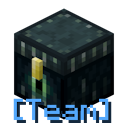

# Team Ender Chest
Welcome to the *Team Ender Chest* Minecraft mod.

If your player is part of a team, you can open an ender chest to access the shared container of your team, by using a trail key, ender eye or spyglass.

